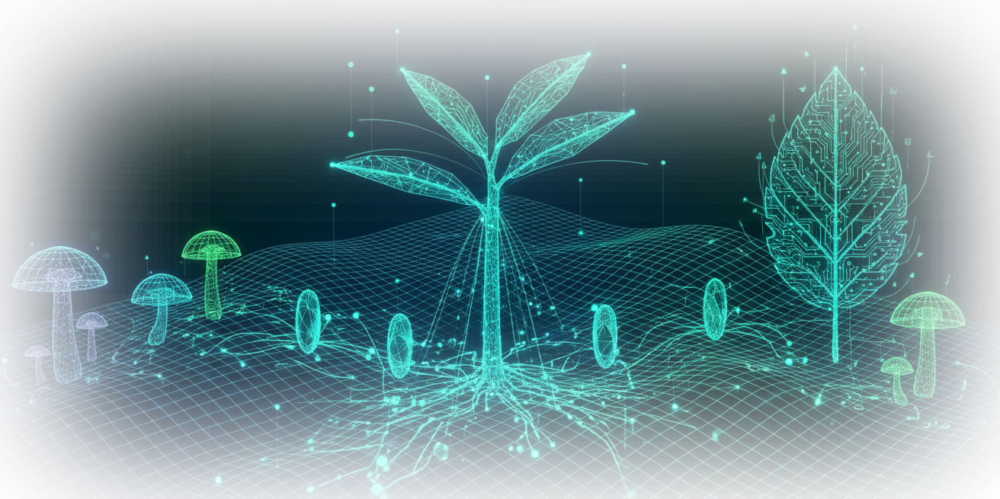

# Bosc de Dades (Bosque de Datos)

> *"Més enllà d'una Smart City, construïm una ciutat de Smart Citizens."*

**Bosc de Dades** és un proyecto de transferencia tecnológica y ciencia ciudadana impulsado por la universidad y el ayuntamiento local. Nuestro objetivo es desplegar una red comunitaria de sensores medioambientales y acústicos construidos y gestionados por la propia ciudadanía.

 ## 📖 Sobre el Proyecto

Este repositorio contiene el código fuente de la página web (Landing Page) del proyecto **Bosc de Dades**. La web está diseñada con una estética inspirada en la intersección entre la naturaleza y el hardware de código abierto.

El proyecto empodera a vecinos y estudiantes para pasar de ser observadores pasivos a científicos de datos activos, creando un mapa en tiempo real de la calidad del aire y la contaminación acústica urbana basándose en la plataforma [Sensor.Community](https://sensor.community/).

## Tecnologías y Hardware

### Software (Web)
* HTML5 (Estructura semántica)
* CSS3 (Variables, Grid, Flexbox, animaciones Marquee)
* Vanilla JavaScript (Animación de partículas en Canvas)
